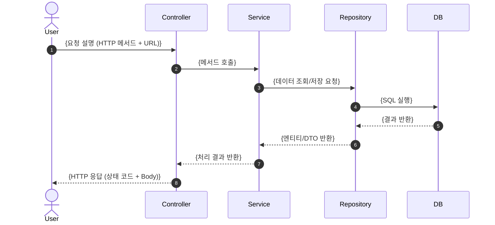
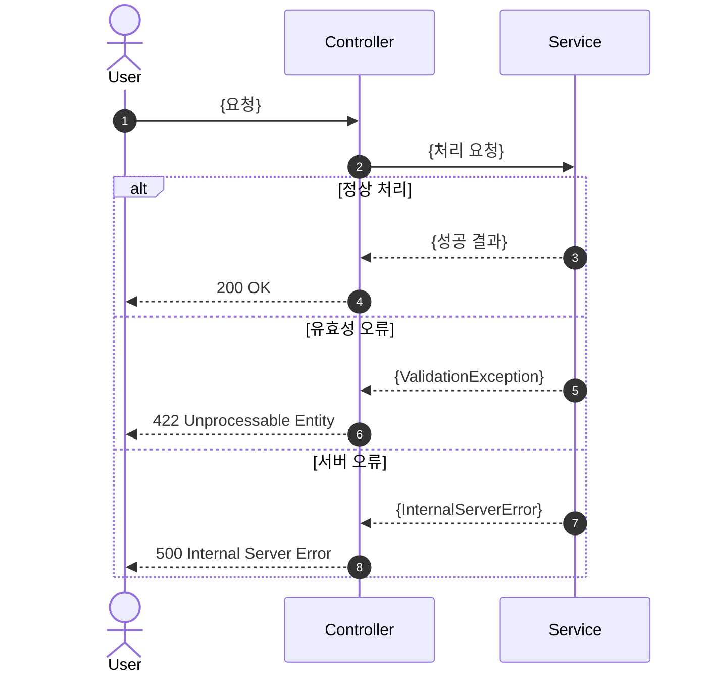

# 시퀀스다이어그램 작성 가이드

## 목적

주요 기능의 객체(Actor, Controller, Service, Repository 등) 간 호출 순서를 시각화하여, 개발자 간 구현 방향을 통일하고 설계 검토의 기준 자료로 활용한다. API 명세서·인터페이스 설계서와 함께 읽으면 백엔드 구현 시 누락 없이 처리 흐름을 파악할 수 있다.

## 작성 시점

설계 단계 중반 — API 명세서 및 인터페이스 설계서 초안 완료 후 작성한다. 구현 중 흐름이 변경될 경우 즉시 갱신한다.

## 메타데이터 헤더

| 항목 | 내용 |
|------|------|
| 문서명 | 시퀀스다이어그램 |
| 프로젝트명 | {프로젝트명} |
| 버전 | {v0.1} |
| 작성일 | {YYYY-MM-DD} |
| 작성자 | {이름 (역할)} |
| 승인자 | {이름 (역할)} |

---

## 필수 섹션 구조

### 1. 시퀀스다이어그램 목록

작성된 시퀀스다이어그램 전체를 한눈에 파악할 수 있는 요약 목록. 다이어그램 ID, 기능명, 관련 API ID, 작성 상태를 기재한다.

### 2. {기능명} 시퀀스 상세

주요 기능별로 소절(`### 2.1`, `### 2.2`, ...)로 구분하여 각각 다음 항목을 작성한다.
- **개요**: 해당 시퀀스가 다루는 유스케이스와 트리거 조건 1~2줄 설명
- **참여 객체**: Actor, Controller, Service, Repository, 외부 시스템 등 열거
- **시퀀스다이어그램**: Mermaid `sequenceDiagram` 코드 블록으로 표현
- **예외 흐름**: 오류 발생 시 대체 흐름(alt/opt 블록 또는 별도 설명)

### 3. 비동기 처리 흐름

202 Accepted 반환 후 WebSocket·Polling·Webhook 등으로 완료를 통보하는 비동기 패턴을 별도로 기술한다. 동기 흐름과 구분하여 처리 단계(요청 → 큐 적재 → 처리 → 알림)를 명시한다.

### 4. 변경 이력

버전별 변경 내용을 추적한다.

---

## 주요 표 템플릿

### 시퀀스다이어그램 목록 표

| SEQ ID | 기능명 | 관련 API ID | 참여 객체 요약 | 작성 상태 |
|--------|--------|------------|--------------|---------|
| {SEQ-모듈약어-001} | {기능명} | {API-모듈-001} | {Actor → Controller → Service → DB} | {작성 중\|완료} |

### Mermaid sequenceDiagram 템플릿

### 예외 흐름 표현 (alt 블록)

### 비동기 처리 흐름 표

| 단계 | 참여 객체 | 설명 |
|------|---------|------|
| 1. 요청 접수 | Client → Controller | {요청 내용, 즉시 202 Accepted 반환} |
| 2. 큐 적재 | Controller → MessageQueue | {작업 ID 포함 메시지 발행} |
| 3. 비동기 처리 | Worker → Service → DB | {실제 처리 수행} |
| 4. 완료 알림 | Worker → {WebSocket\|Webhook\|Polling} | {처리 결과를 클라이언트에 전달} |

### 변경 이력

| 버전 | 변경일 | 변경 내용 | 작성자 | 승인자 |
|------|--------|----------|--------|--------|
| {v0.1} | {YYYY-MM-DD} | {초안 작성} | {이름} | - |
| {v1.0} | {YYYY-MM-DD} | {변경 내용 요약} | {이름} | {이름} |

---

## 작성 팁

- **SEQ ID 체계를 API ID와 연동한다.** `SEQ-{모듈약어}-{순번}` 형식(예: SEQ-AUTH-001)을 유지하고, 목록 표의 "관련 API ID" 컬럼에 API 명세서의 ID를 기입하면 설계 문서 간 교차 참조가 쉬워진다.
- **모든 분기와 예외 흐름을 표현한다.** 정상 흐름만 그리면 구현 단계에서 예외 처리 누락이 발생한다. `alt` / `opt` / `loop` 블록을 적극 활용하여 오류 케이스를 함께 표현한다.
- **비동기 API는 반드시 별도 섹션으로 분리한다.** AI 생성·배치 처리처럼 202 Accepted를 반환하는 API는 동기 흐름과 구분하여 작성하고, 완료 통보 방식(WebSocket·Polling·Webhook)을 명시한다.
- **참여 객체는 실제 클래스명을 사용한다.** 추상적인 "Backend"가 아니라 `AuthController`, `UserService`, `UserRepository`처럼 실제 구현 클래스명을 기재해야 개발자가 코드와 직접 대응할 수 있다.
